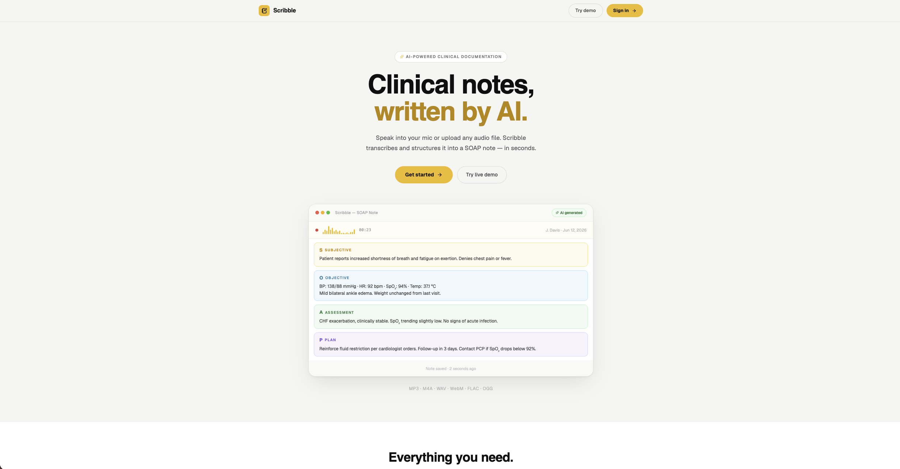
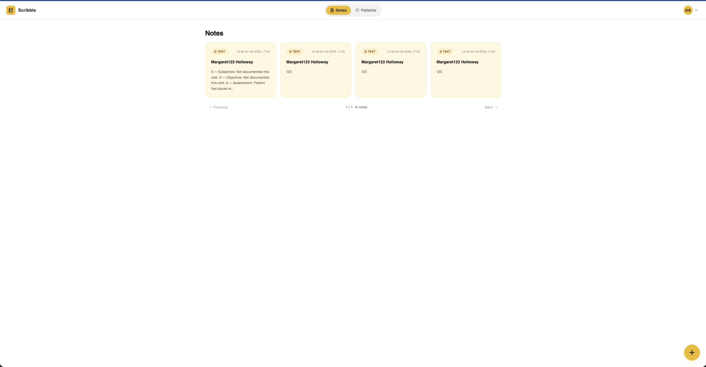
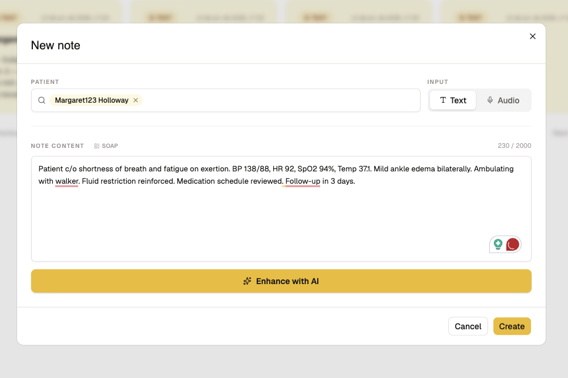
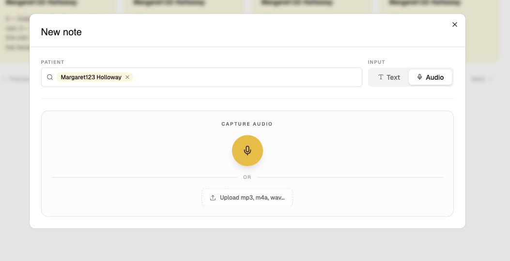
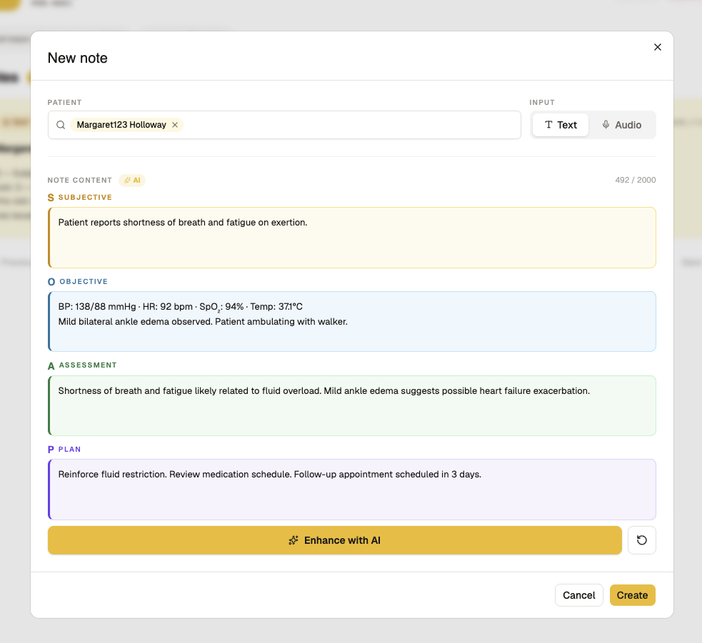
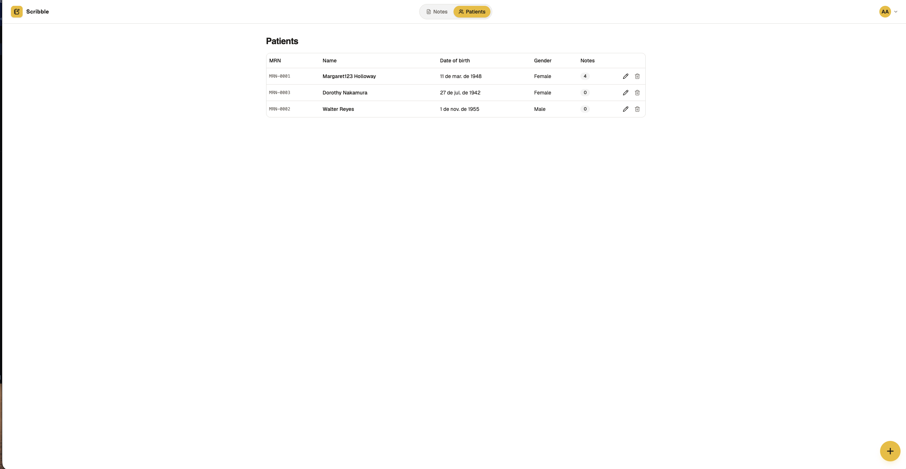
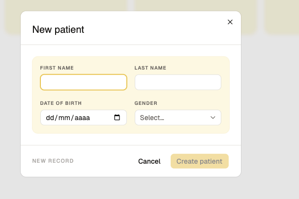
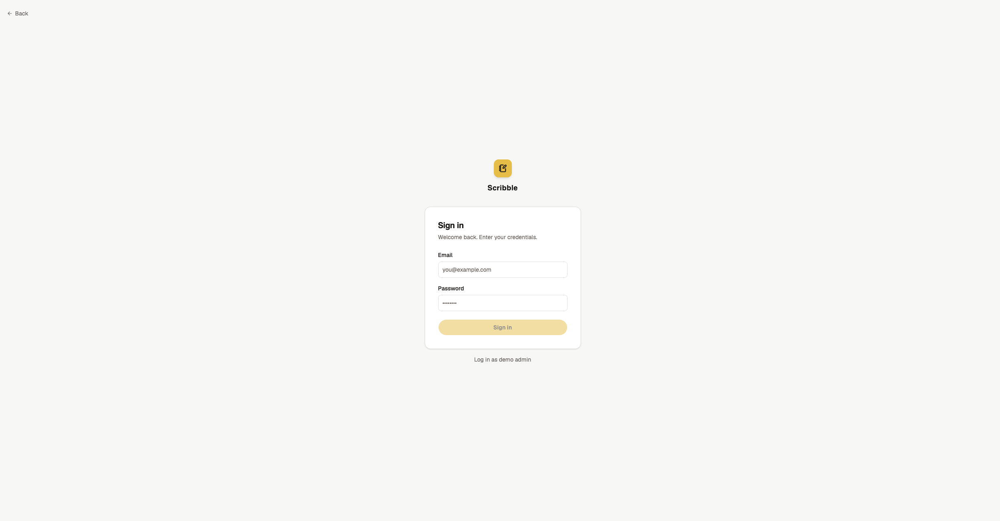

# Scribble

**AI-powered clinical documentation for home healthcare.**

Scribble helps clinicians capture visit notes faster — type or record audio, then let AI transform raw observations into structured SOAP notes. Every note links to a patient record, and the entire workflow lives in a single web app.

**Live demo:** [scribble-alpha-gules.vercel.app](https://scribble-alpha-gules.vercel.app)

---

## Features

### Clinical Documentation
- **SOAP note generation** — write raw visit notes and enhance them into structured Subjective / Objective / Assessment / Plan sections with one click
- **Audio transcription** — record directly in the browser or upload an audio file; transcribed via OpenAI Whisper and converted to SOAP
- **Structured SOAP editor** — four color-coded textareas (one per section) for editing each part independently; toggle between plain text and SOAP view
- **Clinical templates** — pre-filled wound assessment, medication review, vital signs, and general visit prompts to jumpstart documentation
- **Undo / redo AI** — every AI enhancement is reversible; step back to the previous version at any time

### Patient Management
- **Patient records** — create and manage patient profiles with MRN, date of birth, and gender
- **Patient-linked notes** — every note is associated with one or more patients
- **Patient detail view** — see all notes for a specific patient in one place

### App Experience
- **Dashboard** — practice-wide stats (total patients, notes today/this week) and recent activity feed
- **Note viewer** — click any note to view rendered SOAP sections, edit inline, enhance with AI, or delete
- **Quick actions** — floating button to create a note or patient from any page
- **Landing page** — product overview with animated SOAP mock and feature highlights
- **Demo mode** — one-click login with pre-seeded admin account

---

## Screenshots

| Dashboard | Notes |
|---|---|
|  |  |

| New Note | Audio Recording |
|---|---|
|  |  |

| Enhanced SOAP Note | Patients |
|---|---|
|  |  |

| Patient Detail | New Patient |
|---|---|
|  |  |

| Login |
|---|
|  |

---

## Tech Stack

| Layer | Technology |
|---|---|
| Frontend | React 18, TypeScript, Vite, Tailwind CSS v4, shadcn/ui |
| Backend | Node.js 20, Express, TypeScript, Zod |
| Database | PostgreSQL 16, Prisma ORM |
| AI | OpenAI Whisper (transcription), GPT-4o-mini (SOAP generation) |
| Auth | JWT, bcryptjs |
| Testing | Vitest, Supertest |
| CI | GitHub Actions |

### Deployment

| Service | Platform |
|---|---|
| Frontend | [Vercel](https://vercel.com) |
| API Server | [Railway](https://railway.app) |
| Database | [Neon](https://neon.tech) (serverless PostgreSQL) |

---

## Local Development

### Prerequisites

- Docker and Docker Compose
- OpenAI API key (`whisper-1` + `gpt-4o-mini`)

### Setup

```bash
git clone <repo-url>
cd lime
cp .env.example .env
```

Set your OpenAI key in `.env`:

```env
OPENAI_API_KEY=sk-...
```

### Start

First run — seed the database with demo patients and admin account:

```bash
SEED=on docker compose up -d --build
```

Subsequent runs:

```bash
docker compose up -d
```

### Access

| Service | URL |
|---|---|
| Web UI | http://localhost:8080 |
| API | http://localhost:4000 |

Login credentials:

```
Email:    admin@scribe.local
Password: admin123
```

### Hot-reload (dev mode)

```bash
SEED=on docker compose --profile dev up -d --build
```

Starts Vite dev server at http://localhost:5173 with HMR and API proxy.

---

## Project Structure

```
├── server/
│   ├── prisma/          # Schema, migrations, seed data
│   ├── src/
│   │   ├── routes/      # Express route handlers
│   │   ├── services/    # Business logic (auth, notes, AI)
│   │   ├── middleware/  # JWT auth, error handling
│   │   └── storage/     # Audio file storage
│   └── tests/           # Integration tests
├── web/
│   ├── src/
│   │   ├── auth/        # Login, session management
│   │   ├── api/         # API client
│   │   ├── components/  # Shared UI (shadcn/ui, modals)
│   │   ├── features/    # Dashboard, patients, notes, layout
│   │   └── pages/       # Landing page
│   └── public/
└── docker-compose.yml
```

---

## Notes

- **Single user** — one admin account, no registration or multi-user support
- **Synchronous AI** — transcription and enhancement run inline; production would use a job queue
- **25 MB audio limit** — matches the OpenAI Whisper API constraint
- **JWT in localStorage** — sufficient for demo; production should use HttpOnly cookies
